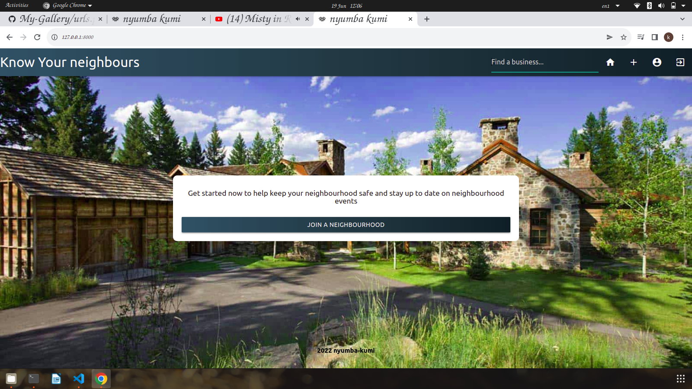

# Know Your Neighbours

This is a web application that allows users to be in the loop about everything happening in their neighbourhood. From contact information of different handymen to meeting announcements or even alerts.

## Screenshot



### Dependencies

In order for you to use the content on this repo ensure you have the following:

- A computer that runs on either of the following; (Windows 7+, Linux, Mac OS)
- Python 3

### Installing

To get the code..

1. Cloning the repository:

```bash
git clone https://github.com/Langat20/Nyumba-Kumi.git
```

2. Navigate to the folder and install requirements. 

```bash
cd Nyumba-kumi
python3 -m venv virtual
source virtual/bin/activate
pip install -r requirements.txt
```

3. Exporting Configurations

```bash
```

4. Running the application

```bash
python3 manage.py runserver
```

Open the application on localhost `127.0.0.1:8000`.


## Running the tests

Testing the application

```bash
python3 manage.py test neighbourhood
```

## Live link


## Built With

* [Python3.8](https://www.python.org/)
* [Django](https://www.djangoproject.com/)

## Known Bugs

- No known bugs yet

## Authors

[Kipkurui Evans]

## Support and contact details

If you run into any issues or have questions, ideas or concerns, reach out to me via e-mail, at evans.kipkurui@student.moringaschool.com

## License

https://choosealicense.com/licenses/mit/ 
Copyright (c) {2022} **Kipkurui Evans**


